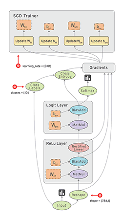

## **什麼是Tensorflow?**  
TensorFlow 是 Google透過使用資料流 (flow) 圖像，來進行數值演算的新一代開源機器學習工具。

## **Tensorflow安裝**  
### MacOS/Linux安裝  
用pip安裝(需先確認電腦中已安裝了pip。若電腦中已安裝了python3.X，因為pip已經自帶在python的模組裡，因此pip也已安裝了)  
#### CPU版本  
開啟terminal    
#如果安裝的是python2.X  
$pip install tensorflow  
#如果安裝的是python3.X  
$pip3 install tensorflow  
### Windows安裝  
支持python3.5(64bit)版本  
開啟command  
c:\>pip install tensorflow  

## **tensorflow數據流圖**

## **實例**
	import tensorflow as tf
	import numpy as np

	#create data
	x_data=np.random.rand(100).astype(np.float32)     #生成100個隨機數列，在tensorflow中大部分的數據的type是float32的形式
	y_data=x_data*0.1+0.3

	#create tensorflow structure start
	Weights=tf.Variable(tf.random_uniform([1],-1.0,1.0))  #tf.random_uniform(結構,左範圍,右範圍)，初始值是-1~1的數
	biases=tf.Variable(tf.zeros([1]))   #初始值是0

	y=Weights*x_data+biases

	loss=tf.reduce_mean(tf.square(y-y_data))   #誤差，預測的y和實際的y_data的差別
	optimizer=tf.train.GradientDescentOptimizer(0.5)   #利用optimizer減少誤差，GradientDescentOptimizer(學習效率)，學習效率<1
	train=optimizer.minimize(loss)

	init=tf.initiallize_all_variables()    #初始化變量
	#create tensorflow structure end

	sess=tf.Session()
	sess.run(init)         #very important

	for step in range(201):
		session.run(train)
		if step%20==0:
			print(step,sess.run(Weights),sess.run(biases))
## **Session**
Tensorflow是基於圖架構進行運算的深度學習框架，Session是圖和執行者之間的媒介，首先透過Session來啟動圖，而Session.run()是用來進行操作的，Session再使用完過後需要透過close來釋放資源，或是透過with as的方式來讓他自動釋放。
	
	import tensorflow as tf

	matrix1=tf.constant([[3,3]])         #Constant就是不可變的常數
	matrix2=tf.constant([[2],[2]])
	product=tf.matmul(matrix1,matrix2)

	#method 1
	session=tf.Session()
	result=sess.run(product)
	print(result)
	sess.close()

	#method 2
	with tf.Session() as sess:
		result2= sess.run(product)
		print(result2)
## **Variable**
將值宣告賦值給變數（Variables）讓使用者能夠動態地進行相同的計算來得到不同的結果，在TensorFlow中是以tf.Variable()來完成。  
在TensorFlow的觀念之中，宣告變數張量並不如Python那麼單純，它需要兩個步驟：  
1.宣告變數張量的初始值、類型與外觀   
2.初始化變數張量
	
	import tensorflow as tf

	state=tf.Variable(0,name='counter')
	#print(state.name)        #print出來的結果為counter:0
	one=tf.constant(1)

	new_value=tf.add(state,one)
	update=tf.assign(state,new_value)    #可以透過tf.assign()賦予不同的值，值得注意的地方是對變數張量重新賦值這件事對tensorflow來說也算是一個運算，必須在宣告之後放入Session中執行，否則重新賦值並不會有作用。
										
	init=tf.initialize_all_variables()   #must have if define variable

	with tf.Session() as sess:
		sess.run(init)
		for _ in range(3):
			sess.run(update)
			print(sess.run(state))

## **Placeholder**
我們可以將它想成是一個佔有長度卻沒有初始值的None，差異在於None不需要將資料類型事先定義，但是Placeholder必須事先定義好之後要輸入的資料類型與外觀。
	
	import tensorflow as tf

	input1=tf.placeholder(tf.float32)    #先定義好之後要輸入的資料類型，tf.placeholder(dtype,shape=None,name=None)
	input2=tf.placeholder(tf.float32)

	output=tf.mul(input1,input2)

	with tf.Session() as sess:
		print(sess.run(output,feed_dict={input1:[7.],input2:[2.]}))    #將資料以python dict餵進(feed)Placeholder之中，print出來的結果為[14.]

## **激勵函數Activation Function**
在類神經網路中使用激勵函數，主要是利用非線性方程式，解決非線性問題，若不使用激勵函數，類神經網路即是以線性的方式組合運算，因為隱藏層以及輸出層皆是將上層之結果輸入，並以線性組合計算，作為這一層的輸出，使得輸出與輸入只存在著線性關係，而現實中，所有問題皆屬於非線性問題，因此，若無使用非線性之激勵函數，則類神經網路訓練出之模型便失去意義。  
1.激勵函數需選擇可微分之函數，因為在誤差反向傳遞(Back Propagation)運算時，需要進行一次微分計算。  
2.在深度學習中，當隱藏層之層數過多時，激勵函數不可隨意選擇，因為會造成梯度消失(Vanishing Gradient)以及梯度爆炸(Exploding gradients)等問題。  
常見的激勵函數的選擇有sigmoid，tanh，ReLU，實用上最常使用ReLU。

##**例子-def add_layer()**
	
	import tensorflow as tf
	import numpy as np
	import matplotlib.pyplot as plt
	def add_layer(inputs,in_size,out_size,activation_function=None):     #add_layer(輸入值,輸入的大小,輸出的大小,激勵函數)
		Weights=tf.Variable(tf.random_normal([in_size,out_size]))    #在生成初始參數時，隨機變量(normal distribution)會比全部為0要好很多，所以這裡的Weights為一個in_size行，out_size列的隨機變量矩陣。
		biases=tf.Variable(tf.zeros([1,out_size])+0.1)               #在機器學習中，biases推薦的初始值不為零，所以+0.1
		Wx_plus_b=tf.matmul(inputs,Weights)+biases		
		if activation_function is None:				     #當activation_function為None時(非線性函數)，輸出就是當前的預測值Wx_plus_b，不為None時，就會把Wx_plus_b傳到activation_function()函數中得到輸出。
			outputs=Wx_plus_b
		else:
			outputs=activation_function(Wx_plus_b)
		return outputs
